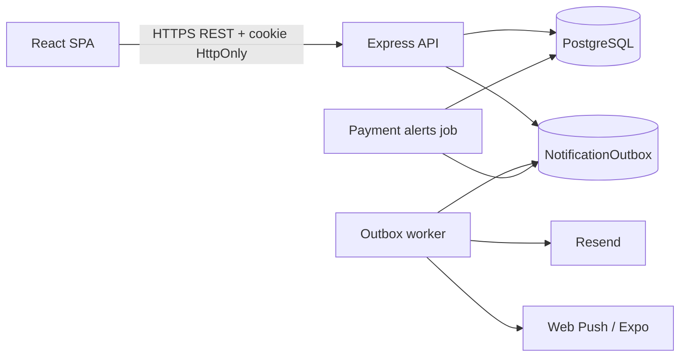

# Arquitectura de FitProApp

**Versión:** 2.0

**Actualización:** 2026-09-16

**Alcance:** backend y frontend web. La aplicación móvil y el chat no forman parte de esta corrección.

## Visión general

FitProApp es un SaaS multi-tenant para entrenadores personales. Cada entrenador administra alumnos, gimnasios, planes, suscripciones, cuotas, rutinas, ejercicios y progreso. El alumno consulta su asignación y registra entrenamientos desde el portal web.



## Stack vigente

| Capa | Tecnologías principales |
|---|---|
| Web | React 19, Vite 8.3, TypeScript 5.8, Tailwind 4, React Query 5, Zustand 5, React Router 7.18, Axios 1.20 |
| API | Express 5, TypeScript 6, Zod 4, JWT, bcrypt, Helmet, express-rate-limit |
| Datos | PostgreSQL, Prisma Client/CLI 6.19, 29 modelos y 31 migraciones |
| Comunicaciones | Resend, Web Push, Expo Push, outbox persistente |
| Calidad | Vitest, Supertest, React Testing Library, Playwright y GitHub Actions |

Los lockfiles se consideran parte del producto. `npm ci` es el mecanismo de instalación reproducible y el backend regenera Prisma Client durante `postinstall`.

## Backend

La API sigue el flujo `route → controller → service → Prisma/PostgreSQL`. Los controllers traducen HTTP, los schemas Zod validan entradas y los services contienen reglas de negocio y transacciones.

```text
backend/
├── prisma/
│   ├── schema.prisma
│   └── migrations/
├── scripts/
│   └── audit-production.mjs
├── src/
│   ├── app.ts
│   ├── server.ts
│   ├── infrastructure/
│   │   ├── db/
│   │   ├── email/
│   │   ├── jobs/
│   │   └── outbox/
│   ├── modules/
│   └── shared/
└── prisma.config.ts
```

Las rutas de negocio se montan bajo `/api`: autenticación, entrenadores, alumnos, planes, suscripciones, portal del alumno, ejercicios, rutinas, planificación semanal, notificaciones, analíticas y gimnasios. `/health` ofrece una comprobación liviana del proceso.

### Middleware y límites

El orden relevante es CORS, Helmet, logging, parser JSON, cookies, limitador global, rutas y manejador de errores. El cuerpo JSON está limitado a 100 KB. Una carga mayor devuelve 413. Las entradas inválidas devuelven 400.

`TRUST_PROXY_HOPS` vale `0` por defecto. En producción debe configurarse con la cantidad exacta de proxies confiables; aceptar indiscriminadamente `X-Forwarded-For` permitiría evadir límites por IP. `RATE_LIMIT_WINDOW_MS` y `RATE_LIMIT_MAX` son configurables. El store actual del limitador vive en memoria y requiere un store compartido antes de ejecutar varias réplicas.

## Seguridad y aislamiento

- Los accesos a recursos se resuelven en el backend y se filtran por entrenador.
- Un entrenador accede a recursos propios y globales. Un alumno solo accede a recursos globales o incluidos en una asignación autorizada.
- Los IDs principales y anidados se validan. Un recurso ajeno se presenta como 404 para no revelar su existencia.
- Los tokens de invitación, verificación y renovación se consumen con escrituras condicionales atómicas.
- El JWT incluye `authVersion`. Cambiar o restablecer la contraseña incrementa esa versión y revoca refresh tokens.
- El refresh token web vive en una cookie HttpOnly; el access token vive en memoria.
- El frontend coordina una sola renovación, impone timeout y descarta respuestas pertenecientes a una sesión anterior.
- Al cerrar sesión se cancelan consultas y se limpia la caché privada. Las claves de React Query incluyen la identidad.

La política productiva de cookies depende de los dominios reales. Antes del despliegue se debe comprobar `Secure`, `SameSite`, `Domain`, CORS y credenciales con las URLs definitivas.

## Datos e integridad histórica

PostgreSQL es la fuente de verdad. Las migraciones aplicadas no se editan; cada cambio crea una migración posterior.

- Los planes, rutinas y ejercicios usados se archivan o retiran sin destruir referencias históricas.
- Suscripciones y sesiones guardan snapshots de nombres, importes y prescripciones relevantes.
- Las relaciones históricas sensibles usan restricciones que impiden borrados destructivos.
- Existe una sola suscripción activa y una sola rutina activa por alumno mediante restricciones de base.
- Las semanas se persisten aunque no tengan overrides y usan versión para detectar escrituras concurrentes.
- Las sesiones usan una clave de idempotencia para evitar duplicados.
- Los días de entrenamiento se calculan en `America/Argentina/Buenos_Aires`; los instantes se almacenan en UTC.

Las consultas de cobros y analíticas agregan, filtran y paginan en PostgreSQL. Los índices compuestos acompañan los filtros por tenant, estado, vencimiento y número de cuota.

## Cobros

Las lecturas calculan estados efectivos sin modificar registros. Reemplazar una suscripción, cancelar cuotas anteriores y crear las nuevas ocurre dentro de una transacción. Pagos, cancelaciones y reemplazos usan condiciones de estado para rechazar carreras con HTTP 409. Los importes se distribuyen con aritmética decimal y la última cuota absorbe el resto exacto.

## Planificación y entrenamiento

Cada semana tiene número, fechas, notas, versión y overrides. Una versión desactualizada devuelve 409; el frontend conserva o restaura el estado visible y solicita recarga. Las sesiones históricas no dependen de que la rutina actual permanezca sin cambios.

## Notificaciones

Las operaciones críticas escriben el evento de notificación en la misma transacción que el cambio de negocio. El worker reclama eventos de forma condicional, cifra payloads sensibles, reintenta con espera exponencial y recupera locks vencidos.

Estados principales:

- `PENDING`: pendiente de reclamar.
- `PROCESSING`: reclamado por un worker.
- `ACCEPTED`: el proveedor aceptó la solicitud; no confirma entrega al destinatario.
- `FAILED`: reintentable.
- `DEAD`: agotó el máximo de intentos.

`OUTBOX_ENCRYPTION_SECRET` debe ser una clave estable e independiente. Rotarla con eventos pendientes impediría descifrarlos.

## Frontend web

La SPA organiza código por features y separa estado local, sesión y datos del servidor.

```text
frontend-app/src/
├── api/
├── auth/
├── components/
├── features/
├── hooks/
├── lib/
├── router/
├── store/
└── types/
```

Axios añade el access token actual. Ante 401, el coordinador intenta una sola renovación compartida y vuelve a ejecutar la solicitud si la identidad y revisión de sesión siguen vigentes. BroadcastChannel coordina pestañas. React Query mantiene datos privados separados por usuario y las mutaciones invalidan todas las vistas afectadas.

El build separa gráficos, navegación/query, UI y vendor. El mayor fragmento actual ronda 400 KB sin comprimir, frente al bundle principal previo de aproximadamente 1,23 MB.

## Contrato HTTP

Las respuestas conservan estos envelopes:

```ts
type Success<T> = { ok: true; message: string; data?: T };
type Failure = { ok: false; message: string; errors?: unknown };
```

| Código | Uso |
|---|---|
| 200/201 | Lectura o escritura exitosa |
| 400 | Entrada, query o parámetro inválido |
| 401 | Sesión ausente, vencida o revocada |
| 404 | Recurso inexistente o inaccesible |
| 409 | Conflicto de estado, versión o idempotencia |
| 413 | Cuerpo de solicitud demasiado grande |
| 429 | Límite de solicitudes excedido |
| 500/503 | Fallo interno o dependencia temporalmente indisponible |

Los detalles operativos están en [docs/API_CONTRACTS.md](docs/API_CONTRACTS.md).

## Calidad y operación

La guía de pruebas está en [docs/TESTING.md](docs/TESTING.md), el procedimiento de base en [docs/MIGRATIONS.md](docs/MIGRATIONS.md) y la secuencia productiva en [docs/DEPLOYMENT.md](docs/DEPLOYMENT.md). GitHub Actions instala desde lockfiles, audita dependencias, compila, ejecuta unitarias e integración y recorre Chromium, Firefox y WebKit.

Las pruebas de integración solo aceptan una URL local cuyo nombre de base contenga `test`. Localmente levantan un PostgreSQL descartable. CI puede suministrar `TEST_DATABASE_URL` con la misma protección.

## Limitaciones operativas abiertas

- Rotar las credenciales locales señaladas en `SEC-001`.
- Validar cookies y CORS con dominios productivos (`AUTH-001`).
- Ensayar bloqueos de migración con un volumen representativo (`MIG-001`).
- Configurar `OUTBOX_ENCRYPTION_SECRET` antes de desplegar (`ENV-002`).
- Firefox no inicia en este host Windows; el workflow Linux mantiene su cobertura (`ENV-001`).
- npm mantiene una alerta alta en la configuración de Prisma CLI sin actualización compatible. El código HTTP no usa esa ruta y CI bloquea cualquier hallazgo alto adicional.
